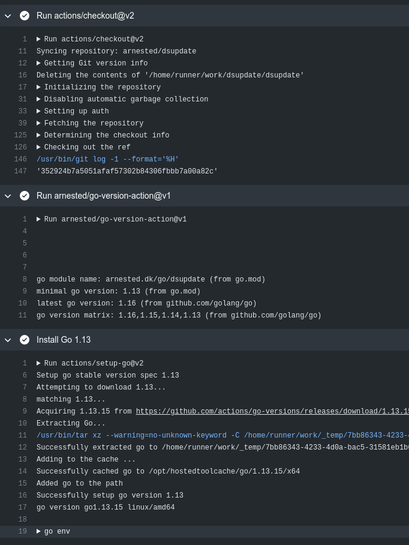
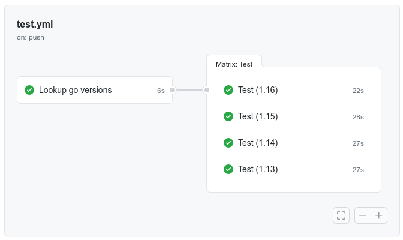
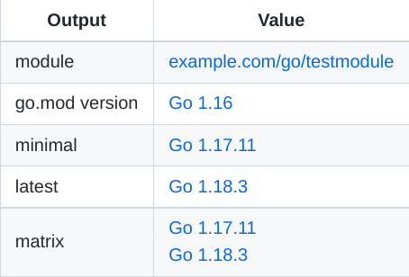

# Go version action

A GitHub action for using the latest released Go version and your
projects minimal support Go version (from go.mod), and a build matrix
of them and all versions in between.

## Motive

Being consistent is hard.

I used to hard code the Go versions my projects needed for test and
builds in my GitHub Actions workflow files.

Of course the result was that I used different versions in the
`go.mod` file and my workflow files.

Whenever a new version of Go was released I forgot to add the new
version to my build matrix and my projects weren't tested on the new
release(s).

So I build this action.

The action reads the minimal supported Go version from your `go.mod`
file and exposes it as a variable to you workflow.

It also pulls the list of release tags from
[https://go.dev/dl/](https://go.dev/dl/) and exposes the latest
released Go version as a variable as well.

From the list of released go versions and the minimal version your
module supports we also build a "matrix" variable to be used as a
build matrix.

While we are at it we also extract the module path from the `go.mod`
file even though it hasn't really anything to do with versions ;)

## Inputs

If your `go mod` file is located in a non standard location you can
specify the working directory where it is located:

```yaml
working-directory:
  description: Working direcory where you go.mod file is located
  required: false
  default: .
```

## Outputs

```yaml
latest:
  description: The latest go version
minimal:
  description: The minial go version (as specified by go.mod)
matrix:
  description: An (stringified) array of go versions from the minimum supported version to the latest released version
module:
  description: The go module name (as specified by go.mod)
```

## Examples

Let's say your `go.mod` specifies go 1.13 as the minimal supported
version and you want your workflow to setup go version 1.13 using the
[actions/setup-go](https://github.com/actions/setup-go) action:

```yaml
name: My go workflow
on: pull_request

jobs:
  my-go-workflow:
    runs-on: ubuntu-latest
    steps:
      - uses: actions/checkout@v2
      - uses: arnested/go-version-action@v1
        id: go-version
      - name: Install Go ${{ steps.go-version.outputs.minimal }}
        uses: actions/setup-go@v2
        with:
          go-version: ${{ steps.go-version.outputs.minimal }}
```



If you want do a matrix test of all Go versions from your minimally
supported version up to the latest released version we need to do a
bit more.

We have to run the version lookup as a separate job and let the test
job depend on it:

```yaml
on: push
name: Test

jobs:
  go-versions:
    name: Lookup go versions
    runs-on: ubuntu-latest
    outputs:
      matrix: ${{ steps.versions.outputs.matrix }}
    steps:
    - uses: actions/checkout@v2
    - uses: arnested/go-version-action@v1
      id: versions
  test:
    name: Test
    runs-on: ubuntu-latest
    needs: go-versions
    strategy:
      matrix:
        version: ${{ fromJSON(needs.go-versions.outputs.matrix) }}
    steps:
    - uses: actions/checkout@v2
    - name: Install Go
      uses: actions/setup-go@v2
      with:
        go-version: ${{ matrix.version }}
    - name: go test
      run: go test -v -race -cover -covermode=atomic -coverprofile=coverage.txt ./...
```



## Summary

The action writes a [GitHub Actions Job
Summary](https://github.blog/2022-05-09-supercharging-github-actions-with-job-summaries/)
with values it identified:


